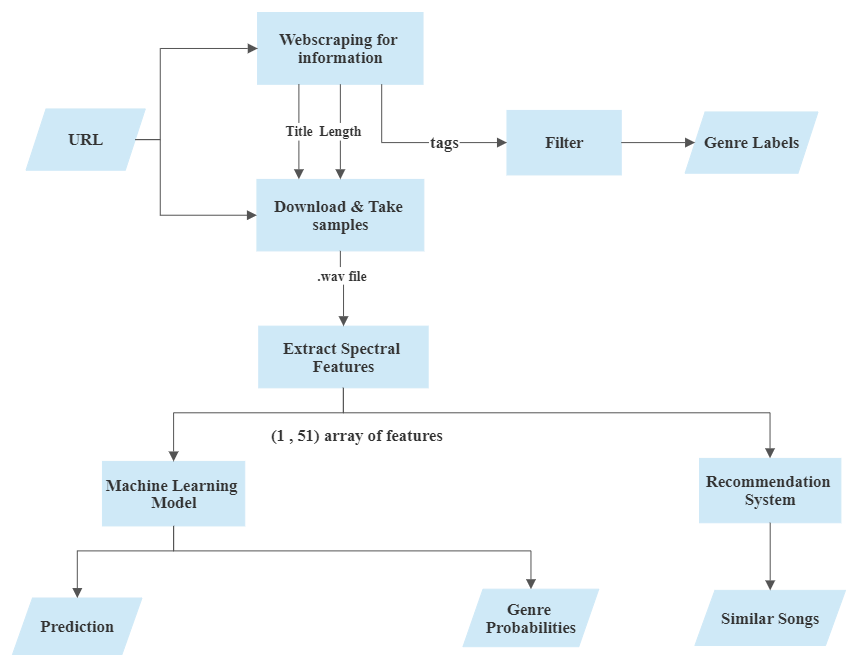

# YouTube Audio Data Processing, Classification and Recommendation System

## Abstract
The rapid growth of digital audio content has made automatic music classification
and recommendation systems a critical research area within signal processing and
machine learning. While commercial platforms such as Spotify rely on proprietary
audio descriptors and extensive user interaction data, open platforms like YouTube
often suffer from incomplete, inconsistent, or entirely missing genre annotations,
particularly for non-Western music traditions.

This undergraduate graduation project (2022) presents an end-to-end, audio-based
framework for music genre classification and similarity-based recommendation using
raw audio signals extracted directly from YouTube. By combining classical signal
processing techniques with machine learning models trained on both public and
custom-built datasets, the proposed system demonstrates the feasibility of automated
genre discovery without dependence on manually curated metadata.

---

## 1. Introduction
Sound is a physical phenomenon arising from mechanical vibrations that propagate
as waves and can be represented mathematically as signals. The mathematical
analysis of sound has a long history, dating back to the work of Pythagoras on
harmonic ratios and later contributions by Euler and other mathematicians whose
theories laid the foundation of modern music theory and signal analysis.

With the digitization of audio, sound signals can be analyzed in both time and
frequency domains, allowing the extraction of descriptive features related to
timbre, rhythm, and spectral structure. These features form the backbone of
contemporary Music Information Retrieval (MIR) systems.

Despite these advances, music genre classification remains inherently challenging
due to its subjective and culturally dependent nature. This challenge is especially
pronounced for regional music on user-generated platforms such as YouTube, where
metadata quality is highly variable. Motivated by this gap, this project aims to
investigate whether meaningful genre classification and recommendation can be
achieved using only audio-derived features.

---

## 2. Problem Definition
Most existing music recommendation systems depend on one or more of the following:
- Manually annotated genre labels,
- Large-scale user interaction data,
- Proprietary, pre-extracted audio descriptors.

However, for Turkish music content on YouTube:
- Genre-related tags are often absent or unreliable,
- Many songs are difficult to discover without explicit search queries,
- Recommendation quality is limited by metadata sparsity.

This project addresses the following research questions:
1. Can music genres be automatically classified using audio signal features alone?
2. Can similarity-based recommendations be generated without user behavior data?
3. Is it possible to build a domain-specific dataset for Turkish music using an
   automated data collection pipeline?

---

## 3. Proposed Framework
An end-to-end framework was developed in Python, using YouTube as the primary
audio data source. The system operates directly on raw audio signals and consists
of three core modules:

1. **Metadata Analysis and Keyword Extraction**  
   Web scraping techniques are employed to extract and filter music-related
   keywords from YouTube video metadata.

2. **Audio Feature Extraction and Genre Classification**  
   Time-domain and frequency-domain features are extracted from audio signals and
   used as inputs to trained machine learning models for genre prediction.

3. **Similarity-Based Recommendation**  
   Given an input audio sample, the system retrieves the top-5 most similar audio
   tracks based on feature-space similarity metrics.

A high-level overview of the system architecture is illustrated below:

---

## 4. Data Collection and Datasets

### 4.1 GTZAN Dataset
A publicly available benchmark dataset was used to train and evaluate a baseline
model for Western music genre classification.

### 4.2 Custom Turkish Music Dataset
To overcome the lack of structured datasets for Turkish music genres, a custom
dataset was constructed using an automated YouTube-based data collection pipeline.
Audio files were extracted, processed, and labeled to create a domain-specific
dataset tailored to the objectives of this study.

---

## 5. Feature Extraction
Audio signals were analyzed in both:
- **Time domain**, capturing amplitude-based characteristics, and
- **Frequency domain**, capturing spectral properties such as MFCCs and related
  descriptors.

Extracted features were statistically summarized to produce compact numerical
representations suitable for machine learning algorithms. Although the primary
application is music classification, the same feature extraction pipeline can be
applied to other signal processing domains, including biomedical signal analysis.

---

## 6. Machine Learning Models
Two machine learning models were developed:

- **Model A (Western Music Classification):**  
  Trained using the GTZAN dataset to establish a baseline for genre classification.

- **Model B (Turkish Music Classification):**  
  Trained using the custom-built Turkish music dataset to evaluate domain-specific
  performance.

Both models were implemented using classical machine learning techniques and
evaluated using standard classification metrics.

---

## 7. Recommendation Module
In addition to genre classification, a similarity-based recommendation module was
implemented. For a given input audio signal, feature-space distances are computed,
and the five most similar audio tracks are returned. This approach enables content
discovery without reliance on user interaction data or manual annotations.

---

## 8. Results and Discussion
Experimental results indicate that:
- Audio-based genre classification is feasible using automatically extracted
  features,
- Domain-specific datasets significantly improve classification relevance,
- Similarity-based recommendations provide a viable alternative for platforms with
  sparse metadata.

The findings highlight the potential of signal-processing-driven approaches for
music recommendation in open, user-generated content platforms.

---

## 9. Technologies Used
- Python  
- Librosa  
- NumPy, Pandas  
- Scikit-learn  
- XGBoost  
- BeautifulSoup  
- yt-dlp  

---

## 10. Academic Context
- **Degree:** B.Sc. in Electrical and Electronics Engineering  
- **University:** Istanbul Kültür University  
- **Year:** 2022  
- **Project Type:** Undergraduate Graduation Project  

---

## 11. Authors
- **Ipek Iraz Esin**  
- Mert Ertürk
